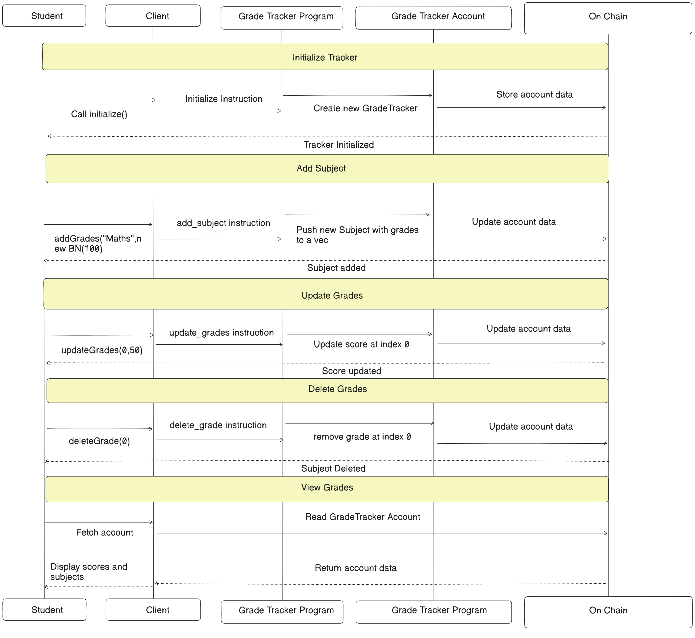

## User Story
```
As a student , I want to track my grades for each subject in a simple way so that i can easily manage my academics and improve my performance.

I can add new grades for each subject whenever i want to update my grades.

Incase my grades are incorrect and i get them revaluated , I can update my grades accordingly.

If i need to drop a subject , I can remove it from my grade tracker.
```


## Architecture Diagram



## Try yourself

```
git clone https://github.com/DeepanshuMishraa/grady.sol.git
```

```
cd grady-sol
```

```
yarn install
```

- Building

```
anchor build
```

- Testing

```
anchor test
```
